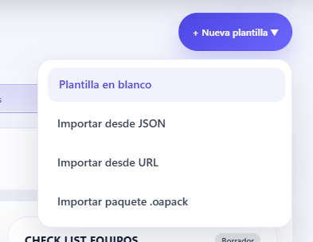
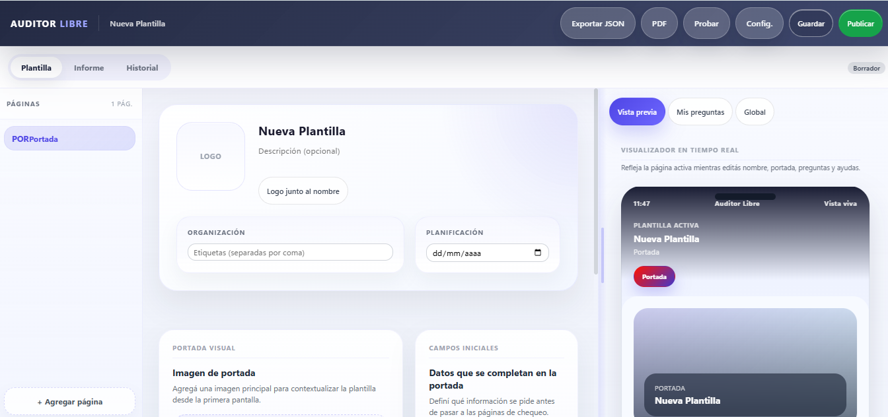
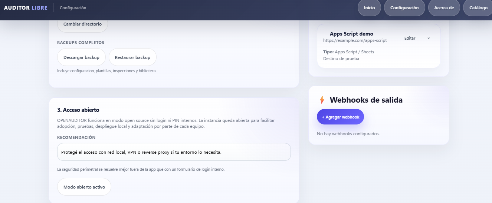

#  ___  ____  _____ _   _    _    _   _ ____ ___ _____ ___  ____
# / _ \|  _ \| ____| \ | |  / \  | | | |  _ \_ _|_   _/ _ \|  _ \
#| | | | |_) |  _| |  \| | / _ \ | | | | | | | |  | || | | | |_) |
#| |_| |  __/| |___| |\  |/ ___ \| |_| | |_| | |  | || |_| |  _ <
# \___/|_|   |_____|_| \_/_/   \_\\___/|____/___| |_| \___/|_| \_\

[](#7-step-by-step-installation-on-windows)
[](#13-offline-work)
[](#4-product-philosophy)
[](#16-production-step-by-step)

**The open source, offline-first alternative for inspections, audits, and operational checklists without per-user licensing.**

OPENAUDITOR lets teams build templates, test them before publishing, run inspections from desktop or mobile, work offline, sync when needed, and export reports while keeping full control of their data.

---

## -1. Why OPENAUDITOR wins

| Topic | OPENAUDITOR | Typical closed product |
|---|---|---|
| Per-user licensing | Not required | Usually required |
| Data ownership | Yours | Vendor-dependent |
| Offline work | Yes | Sometimes limited |
| Self-hosting | Yes | Not always |
| Community extensibility | Yes | No |
| Integration freedom | High | Plan-limited |
| Local-first workflow | Yes | Rare |

**OPENAUDITOR turns inspections into an open platform you can install now, adapt later, and still fully control.**

---

## 0. Screenshots

### Main dashboard


### Create or import template menu



### Editor with real-time live preview



### Open configuration and sync destinations



---

## 1. What OPENAUDITOR is

OPENAUDITOR is an open source platform to:

1. build inspection templates,
2. test them before publishing,
3. run inspections in the field,
4. capture evidence,
5. export reports,
6. work offline,
7. and sync optionally with free or self-hosted backends.

### What it already does

- Visual template editor
- Pages, sections, and questions
- Cover page with branding and image
- Logo next to the template name
- Conditional logic
- Scoring
- Notes, photos, corrective actions, and signature
- `Test` mode before publishing
- Improved field inspector UI
- Filters like `Pending only`, `Required only`, and `With evidence`
- Live findings panel
- Finalization lock if required answers are missing
- `PDF`, `CSV`, `XLSX`, and `JSON` exports
- Standalone HTML for offline mobile use
- Offline inspection import later
- Optional sync to `Apps Script`, `webhooks`, `PocketBase`, `Supabase`, and others
- Community template catalog
- Templates aligned with Argentine legal safety frameworks

---

## 2. Ideal use cases

- HSE / SST
- safety audits
- maintenance inspections
- retail operations
- contractor control
- legal compliance walk-throughs
- pre-operational vehicle checks
- fire extinguisher inspections
- housekeeping and order
- electrical risk checklists

---

## 3. Core product idea

OPENAUDITOR is designed around these principles:

1. Your data stays yours.
2. The tool should work even without internet.
3. Open source should not force internal login or role friction by default.
4. Deployment should stay simple.
5. The community must be able to extend it.

---

## 4. Product philosophy

- Open source
- Local-first
- Offline-friendly
- No mandatory internal login
- No forced cloud dependency
- Portable
- Hackable

---

## 5. Tech stack

- `Node.js`
- `Express`
- `better-sqlite3`
- Vanilla `HTML`, `CSS`, and `JavaScript`
- `Puppeteer` for PDF
- `ExcelJS`
- `Multer`
- `QRCode`
- `Archiver` / `adm-zip`

---

## 6. Requirements

### Minimum

- `Node.js >= 18`
- `npm`
- modern browser

### Recommended

- `Node.js 20`
- `Git`
- at least `2 GB` of free disk space

---

## 7. Step-by-step installation on Windows

### Step 1. Install Node.js

1. Open `https://nodejs.org/`
2. Download the `LTS` version
3. Run the installer
4. Reopen PowerShell

### Step 2. Verify Node and npm

```powershell
node -v
npm -v
```

### Step 3. Install Git

1. Open `https://git-scm.com/download/win`
2. Install Git
3. Reopen PowerShell

Verify:

```powershell
git --version
```

### Step 4. Clone the project

```powershell
cd "C:\Users\YOUR_USER\Documents"
git clone https://github.com/apu242007/OPENAUDITOR.git
cd OPENAUDITOR
```

### Step 5. Install dependencies

```powershell
npm install
```

### Step 6. Start the app

```powershell
npm start
```

### Step 7. Open the app

```text
http://localhost:3001
```

### Step 8. Verify key pages

```text
http://localhost:3001
http://localhost:3001/catalog
http://localhost:3001/settings
http://localhost:3001/about
```

### Step 9. Verify open mode

```powershell
curl http://localhost:3001/api/auth/status
```

Expected:

```json
{"securityRequired":false,"authenticated":true,"mode":"open"}
```

### Step 10. Run tests

```powershell
npm test
```

---

## 8. Quick start for developers

```bash
git clone https://github.com/apu242007/OPENAUDITOR.git
cd OPENAUDITOR
npm install
npm start
```

---

## 9. Available scripts

```bash
npm start
npm run dev
npm run start:prod
npm run check:prod
npm test
npm run test:coverage
npm run lint
npm run pm2:start
npm run pm2:restart
npm run pm2:logs
```

---

## 10. First-use walkthrough

### Flow 1. Create a template from scratch

1. Open `http://localhost:3001`
2. Click `Nueva plantilla`
3. Create a blank template
4. Add pages, sections, and questions
5. Save the draft

### Flow 2. Import a real example template

1. Open the dashboard
2. Click `Importar desde JSON`
3. Choose a community template
4. Click `Usar ejemplo`
5. Edit the imported draft

### Flow 3. Test before publishing

1. Open the editor
2. Save the draft
3. Click `Probar`
4. Run a live test inspection

### Flow 4. Publish

1. Review structure and branding
2. Test it
3. Click `Publicar`

### Flow 5. Run an inspection

1. Start from a published template
2. Answer questions
3. Add notes, photos, and actions
4. Use smart filters
5. Finish only when required answers are complete

---

## 11. Editor highlights

- Real-time preview
- Resizable preview panel
- Cover page image
- Template logo
- Conditional logic
- Question library
- Repeatable sections
- PDF preview
- Test mode

---

## 12. Inspector highlights

- Page progress
- Sidebar navigation
- Section metrics
- Pending-only mode
- Required-only mode
- Evidence-only mode
- Compact mode
- Collapse answered
- Next pending
- Next required
- Live findings panel
- Severity prioritization
- Executive summary
- Finalization block for missing required answers

---

## 13. Offline work

### Local mode

1. Run the app locally
2. Keep everything on your machine
3. Export whenever you need

### Standalone offline mode

1. Export a standalone HTML inspection
2. Open it on a phone
3. Fill it out offline
4. Export JSON or sync later

### Offline plus sync mode

1. Work offline
2. Reconnect later
3. Send data to:
   - Apps Script
   - webhook
   - PocketBase
   - Supabase
   - another OPENAUDITOR node

---

## 14. Free and open sync options

### Apps Script + Google Sheets

1. Export standalone HTML
2. Configure an Apps Script destination
3. Send `sheetSchema` and `flatRow`
4. Create one sheet per template
5. Grow columns automatically

### Webhook

1. Configure a destination URL
2. Send JSON by `fetch`
3. Store it in any backend you own

### PocketBase or Supabase

1. Deploy your backend
2. Configure sync destination
3. Receive inspections and evidence

---

## 15. Community catalog

Included categories already cover:

- safety
- maintenance
- retail
- quality
- construction
- vehicles

---

## 16. Production step by step

### Option A. Production with Node

```bash
npm install
npm run start:prod
npm run check:prod
```

### Option B. Production with PM2

```bash
npm install
npm run pm2:start
npm run pm2:logs
```

### Option C. Production with Docker

```bash
docker compose up -d --build
docker compose ps
```

Useful deployment files:

- [ecosystem.config.js](c:/Users/jcastro/OneDrive%20-%20EXERTION%20AI/01-APPS%20GITHUB/OPENAUDITOR/ecosystem.config.js)
- [Dockerfile](c:/Users/jcastro/OneDrive%20-%20EXERTION%20AI/01-APPS%20GITHUB/OPENAUDITOR/Dockerfile)
- [docker-compose.yml](c:/Users/jcastro/OneDrive%20-%20EXERTION%20AI/01-APPS%20GITHUB/OPENAUDITOR/docker-compose.yml)
- [nginx.conf.example](c:/Users/jcastro/OneDrive%20-%20EXERTION%20AI/01-APPS%20GITHUB/OPENAUDITOR/nginx.conf.example)

---

## 17. Quick health checks

```powershell
curl http://localhost:3001/readyz
curl http://localhost:3001/health
curl http://localhost:3001/api/auth/status
```

---

## 18. Repository structure

```text
OPENAUDITOR/
├─ public/
├─ routes/
├─ lib/
├─ templates/catalog/
├─ docs/
├─ plugins/
├─ schemas/
├─ test/
├─ server.js
├─ standalone_inspection.js
└─ pdf_report.js
```

---

## 19. Contributing

1. Fork the repo
2. Create a branch
3. Implement your change
4. Run tests
5. Open a pull request

See also:

- [CONTRIBUTING.md](c:/Users/jcastro/OneDrive%20-%20EXERTION%20AI/01-APPS%20GITHUB/OPENAUDITOR/CONTRIBUTING.md)
- [ROADMAP.md](c:/Users/jcastro/OneDrive%20-%20EXERTION%20AI/01-APPS%20GITHUB/OPENAUDITOR/ROADMAP.md)
- [CHANGELOG.md](c:/Users/jcastro/OneDrive%20-%20EXERTION%20AI/01-APPS%20GITHUB/OPENAUDITOR/CHANGELOG.md)

---

## 20. Final summary

If you want an inspection platform that is:

- open source,
- offline-first,
- easy to install,
- export-friendly,
- adaptable,
- and not tied to per-user licensing,

**OPENAUDITOR is already a strong foundation to build on.**
